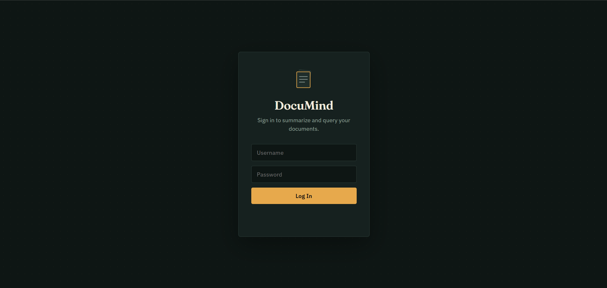
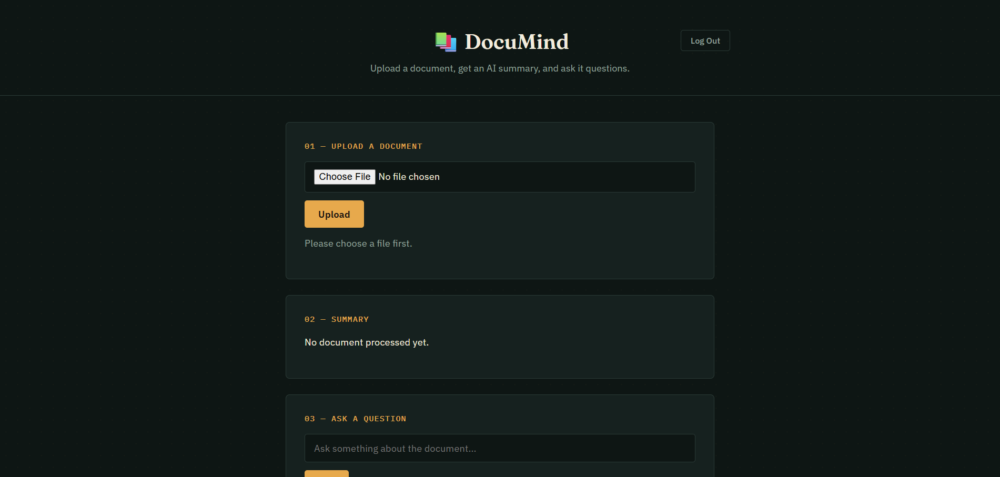
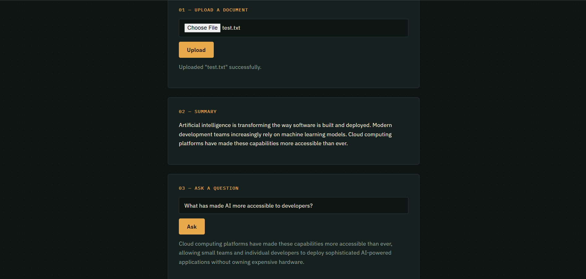

# DocuMind 📚

> Intelligent Document Summarizer & Q&A System

DocuMind lets you upload a PDF, DOCX, or TXT file, generates an AI-powered summary of it, and answers natural-language questions about its content — all through a secured REST API and a lightweight web frontend.

[](https://www.djangoproject.com/)
[](https://www.django-rest-framework.org/)
[](https://www.postgresql.org/)
[](https://www.docker.com/)
[](https://huggingface.co/docs/transformers/index)

## 🚀 Features

- 📄 **Multi-format Support**: PDF, DOCX, TXT
- 🤖 **AI Summarization**: Generates concise summaries using BART
- ❓ **Q&A System**: Ask questions and get semantically relevant answers, powered by FAISS + sentence embeddings
- 🔐 **JWT Authentication**: Secure API access with a working login flow
- 🐳 **Containerized**: Fully Dockerized — Django, PostgreSQL, and Redis run together via Docker Compose
- 📊 **API Documentation**: Interactive Swagger/OpenAPI docs

## 📸 Screenshots

### Login

*Sign in with JWT-based authentication*

---

### Document Workflow

*Upload a document, then get an AI summary and ask questions — all in one flow*

---

### Summarization & Q&A in Action

*BART-generated summary and a FAISS-powered answer to a real question about the uploaded document*

## 🛠️ Tech Stack

| Category | Technologies |
|----------|--------------|
| **Backend** | Django, Django REST Framework (DRF), Celery, Redis |
| **AI / ML** | Transformers (BART), Sentence Transformers, FAISS |
| **Database** | PostgreSQL |
| **DevOps** | Docker, Docker Compose, Gunicorn |
| **Frontend** | HTML, CSS, Vanilla JavaScript |

## 📦 Installation

### Using Docker (Recommended)

```bash
# Clone repository
git clone https://github.com/IshitaSajeev/Documind.git
cd documind

# Copy environment variables
cp backend/.env.example backend/.env

# Start services
docker-compose up --build
```

The API will be available at `http://localhost:8000`, with interactive docs at `http://localhost:8000/swagger/`.

### Manual Setup (without Docker)

```bash
cd backend

# Create virtual environment
python -m venv venv
source venv/bin/activate  # On Windows: venv\Scripts\activate

# Install dependencies
pip install -r requirements.txt

# Run migrations
python manage.py makemigrations core
python manage.py migrate

# Create superuser
python manage.py createsuperuser

# Run server
python manage.py runserver
```

### Frontend

```bash
cd frontend
python -m http.server 5500
```
Then open `http://localhost:5500/login.html` in your browser.

## 📖 API Endpoints

| Method | Endpoint | Description |
|--------|----------|-------------|
| POST | `/api/token/` | Get JWT access + refresh token |
| POST | `/api/token/refresh/` | Refresh an expired access token |
| POST | `/api/documents/upload/` | Upload and process a document |
| GET | `/api/documents/` | List all documents for the current user |
| GET | `/api/documents/{id}/` | Get a single document's details |
| DELETE | `/api/documents/{id}/` | Delete a document |
| POST | `/api/documents/{id}/ask/` | Ask a question about a document |
| GET | `/api/documents/{id}/questions/` | Get question history for a document |

## 🎯 Usage Example

### Get a token

```python
import requests

auth_response = requests.post(
    'http://localhost:8000/api/token/',
    json={'username': 'your-username', 'password': 'your-password'}
)
token = auth_response.json()['access']
```

### Upload a document

```python
headers = {'Authorization': f'Bearer {token}'}
files = {'file': open('document.pdf', 'rb')}
response = requests.post(
    'http://localhost:8000/api/documents/upload/',
    headers=headers,
    files=files
)
print(response.json())
```

### Ask a question

```python
document_id = response.json()['id']

question_data = {'question': 'What is the main topic?'}
response = requests.post(
    f'http://localhost:8000/api/documents/{document_id}/ask/',
    headers=headers,
    json=question_data
)
print(response.json())
```

## 🏗️ Architecture

```text
documind/
├── backend/
│   ├── api/                  # REST API views, serializers, routing
│   ├── core/                 # Document & Question models
│   ├── services/             # Text extraction, summarization & Q&A logic
│   ├── documind/             # Django settings & root URLs
│   └── Dockerfile
├── frontend/                 # Login page & document workflow UI
├── docker-compose.yml        # Django + PostgreSQL + Redis services
└── docs/
    └── screenshots/          # README images
```

## 🧪 Testing

```bash
python manage.py test
```

## 🤝 Contributing

Pull requests are welcome! For major changes, please open an issue first.

## 📄 License

[MIT](LICENSE)
